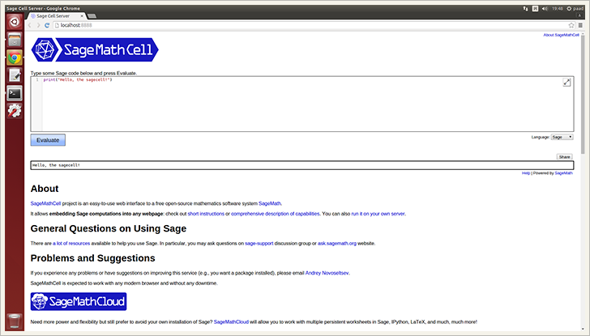

.. contents:: Table of contents
   :depth: 3

Introduction
============
Yep, you can use this `NOT simple installation <https://github.com/sagemath/sagecell#simple-installation>`_. Oops, does not work. Use the SageMathCell installer, because it is just easier :).

Portability
===========
The SageMathCell installer tested on **Ubuntu 14.04.2 LTS**, **Ubuntu 15.04** and **Debian 7.8**.

Installation
============
Install the sagecell from PyPI
------------------------------
::

    $ sudo pip install sagecell

Install the sagecell from GitHub
--------------------------------
::

    $ sudo pip install git+git://github.com/korniichuk/sagecell#egg=sagecell

Upgrade the sagecell from PyPI
------------------------------
::

    $ sudo pip install -U sagecell

or::

    $ sudo pip install --upgrade sagecell

Uninstall the sagecell
----------------------
::

    $ sudo pip uninstall sagecell

Development installation
========================
::

    $ git clone git://github.com/korniichuk/sagecell.git
    $ cd sagecell
    $ sudo pip install .

Quickstart
==========
**First**, install the SageMathCell::

    $ sagecell install

**Second**, make sure that you can login to a localhost without entering password::

    $ ssh localhost

.. note:: You can `setup SSH for auto login to localhost without a password`_ like this: ``$ sagecell ssh``.

**Third**, start the SageMathCell::

    $ sagecell start

.. important:: Do not close the current terminal.

**Fourth**, open a new terminal for the next command::

    $ sagecell open

This command open browser with the SageMathCell.

Express
-------
::

    $ sagecell install
    $ sagecell ssh
    $ sagecell start

    # In a new terminal
    $ sagecell open

User guide
==========
Help
----
The standard output for –help::

    $ sagecell -h

or::

    $ sagecell --help

For information on using subcommand "SUBCOMMAND", do::

    $ sagecell SUBCOMMAND -h

or::

    $ sagecell SUBCOMMAND --help

Example::

    $ sagecell install -h

Version
-------
The standard output for –version::

    $ sagecell -v

or::

    $ sagecell --version

Install the SageMathCell
------------------------
::

    $ sagecell install

Start the SageMathCell
----------------------
::

    $ sagecell start

Open browser with the SageMathCell
----------------------------------
::

    $ sagecell open

Setup SSH for auto login to localhost without a password
--------------------------------------------------------
::

   $ sagecell ssh

If you are familiar with `ssh-keygen <http://www.openbsd.org/cgi-bin/man.cgi?query=ssh-keygen&sektion=1>`_, `ssh-copy-id <http://linux.die.net/man/1/ssh-copy-id>`_ and `ssh-add <http://www.openbsd.org/cgi-bin/man.cgi?query=ssh-add&sektion=1>`_, this code also setup SSH for auto login to localhost without a password [1]_::

    $ ssh-keygen -t rsa -b 4096 -N '' -f ~/.ssh/id_rsa
    $ ssh-copy-id localhost
    $ eval "$(ssh-agent -s)"
    $ ssh-add ~/.ssh/id_rsa

Start the SageMathCell automatically on boot
--------------------------------------------
With the SageMathCell
^^^^^^^^^^^^^^^^^^^^^
::

    $ sagecell auto

.. note:: The default port number is 8888.

For changing a port number. First, edit the ``/usr/local/bin/sagecellscript`` file::

    $ sudo nano /usr/local/bin/sagecellscript

or::

    $ su -c "nano /usr/local/bin/sagecellscript"

Second, change the last line from::
    
    ../sage web_server.py

to::

    ../sage web_server.py -p PORT_NUMBER

Where:

* ``PORT_NUMBER`` -- a port number.

Example::

    ../sage web_server.py -p 6363

Without the SageMathCell
^^^^^^^^^^^^^^^^^^^^^^^^
First, install `screen <http://ss64.com/bash/screen.html>`_::

    $ sudo apt-get install screen

or::

    $ su -c "apt-get install screen"

Second, create the ``/usr/local/sbin/sagecellscript`` file::

    #! /bin/sh

    cd ~/sc_build/sage/sagecell
    ../sage web_server.py

or::

    #! /bin/sh

    cd ~/sc_build/sage/sagecell
    ../sage web_server.py -p PORT_NUMBER

Where:

* ``PORT_NUMBER`` -- a port number.

.. note:: The default port number is 8888.

Example::

    #! /bin/sh

    cd ~/sc_build/sage/sagecell
    ../sage web_server.py -p 6363

Third, make the ``/usr/local/sbin/sagecellscript`` file  executable::

    $ sudo chmod 755 /usr/local/sbin/sagecellscript

or::

    $ su -c "chmod 755 /usr/local/sbin/sagecellscript"

Fourth, edit the ``/etc/rc.local`` file::

    $ sudo nano /etc/rc.local

or::

    $ su -c "nano /etc/rc.local"

Add the next command below the comment, but leave the line ``exit 0`` at the end, then save the file and exit::

    sudo -u USERNAME screen -dmS sagecell /usr/local/sbin/sagecellscript

or::

    su USERNAME -c "screen -dmS sagecell /usr/local/sbin/sagecellscript"

Where:

* ``USERNAME`` -- a username.

Example::

    sudo -u albert screen -dmS sagecell /usr/local/sbin/sagecellscript

or::

    su albert -c "screen -dmS sagecell /usr/local/sbin/sagecellscript"

Transfer a short temporary links
--------------------------------
Replace the ``~/sc_build/sage/sagecell/sqlite.db`` file with a `shortened temporary links <http://sagecell.sagemath.org/static/about.html?v=0d09e#permalinks>`_::

    $ scp SOURCE_FILE REMOTE_USERNAME@REMOTE_HOST:~/sc_build/sage/sagecell/sqlite.db

Example::

    $ scp ~/Downloads/sqlite4transfer.db albert@192.168.0.1:~/sc_build/sage/sagecell/sqlite.db

Disable the terms of service requirement
----------------------------------------
For disabling the terms of service requirement. First, edit the ``~/sc_build/sage/sagecell/config.py`` file::

    $ nano ~/sc_build/sage/sagecell/config.py

Second, change the line of code from::

    requires_tos = True

to::

    requires_tos = False

Third, reboot a server from command line::

    $ reboot

.. rubric:: Footnotes

.. [1] https://help.github.com/articles/generating-ssh-keys/
