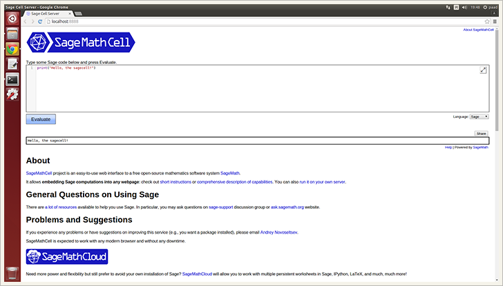

.. contents:: Table of contents
   :depth: 2

Introduction
============
Yep, you can use this `NOT simple installation <https://github.com/sagemath/sagecell#simple-installation>`_. Oops, does not work. Use the Sage Cell Server installer, because it is just easier :).

Installation
============
Install the sagecell from PyPI
------------------------------
::

    $ sudo pip install sagecell

Install the sagecell from GitHub
--------------------------------
::

    $ sudo pip install git+git://github.com/korniichuk/sagecell#egg=sagecell

Upgrade the sagecell from PyPI
------------------------------
::

    $ sudo pip install -U sagecell

or::

    $ sudo pip install --upgrade sagecell

Uninstall the sagecell
----------------------
::

    $ sudo pip uninstall sagecell

Development installation
========================
::

    $ git clone git://github.com/korniichuk/sagecell.git
    $ cd sagecell
    $ sudo pip install .

Quickstart
==========
**First**, install the Sage Cell Server::

    $ sagecell install

**Second**, make sure that you can login to a localhost without entering password::

    $ ssh localhost

.. note:: You can `setup SSH for auto login to localhost without a password`_ like this: ``$ sagecell ssh``.

**Third**, start the Sage Cell Server::

    $ sagecell start

.. important:: Do not close the current terminal.

**Fourth**, open a new terminal for the next command::

    $ sagecell open

This command open browser with the Sage Cell Server.

Express
-------
::

    $ sagecell install
    $ sagecell ssh
    $ sagecell start

    # In a new terminal
    $ sagecell open

User guide
==========
Help
----
The standard output for –help::

    $ sagecell -h

or::

    $ sagecell --help

For information on using subcommand "SUBCOMMAND", do::

    $ sagecell SUBCOMMAND -h

or::

    $ sagecell SUBCOMMAND --help

Example::

    $ sagecell install -h

Version
-------
The standard output for –version::

    $ sagecell -v

or::

    $ sagecell --version

Install the Sage Cell Server
----------------------------
::

    $ sagecell install

Start the Sage Cell Server
--------------------------
::

    $ sagecell start

Open browser with the Sage Cell Server
--------------------------------------
::

    $ sagecell open

Setup SSH for auto login to localhost without a password
--------------------------------------------------------
::

   $ sagecell ssh

If you are familiar with `ssh-keygen <http://www.openbsd.org/cgi-bin/man.cgi?query=ssh-keygen&sektion=1>`_, `ssh-copy-id <http://linux.die.net/man/1/ssh-copy-id>`_ and `ssh-add <http://www.openbsd.org/cgi-bin/man.cgi?query=ssh-add&sektion=1>`_, this code also setup SSH for auto login to localhost without a password [1]_::

    $ ssh-keygen -t rsa -b 4096 -N '' -f ~/.ssh/id_rsa
    $ ssh-copy-id localhost
    $ eval "$(ssh-agent -s)"
    $ ssh-add ~/.ssh/id_rsa

.. rubric:: Footnotes

.. [1] https://help.github.com/articles/generating-ssh-keys/
